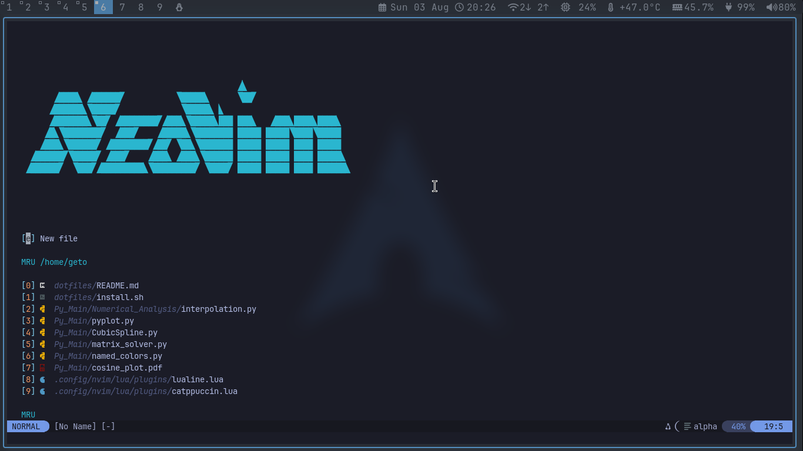
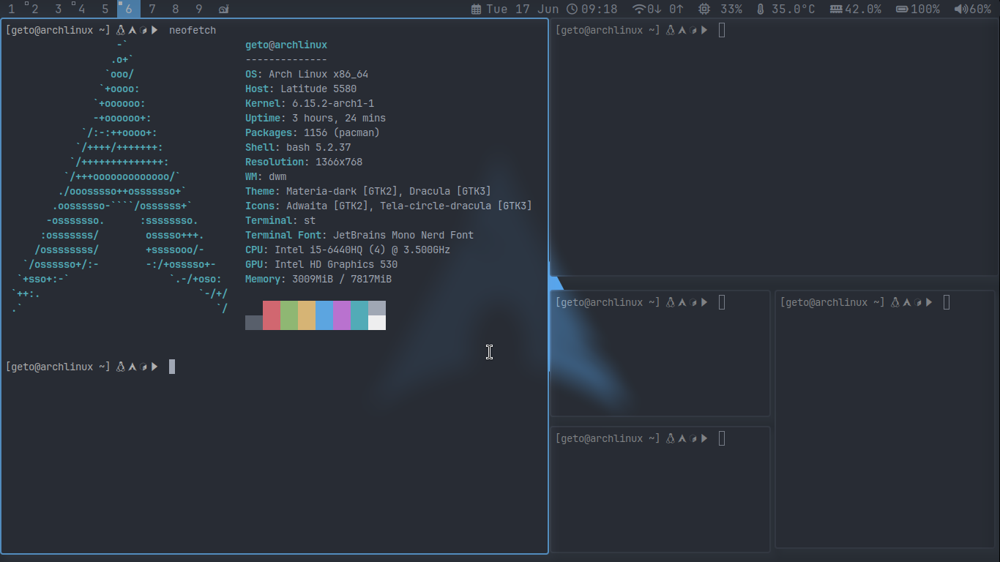
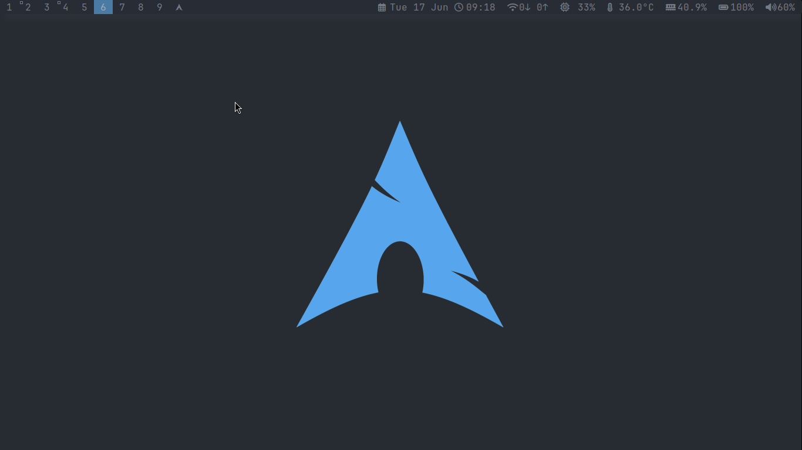

# 🖥️ Dotfiles - Arch Linux Configuration




This repository contains my personal Linux configuration files for a streamlined Arch Linux setup featuring Neovim for embedded programming, suckless tools, Picom, and tiling window management.

## 📦 Repository Contents

```bash
.
├── install.sh        # Automated setup script
├── LICENSE           # MIT License
├── README.md         # This documentation
├── .bashrc           # Bash configuration
├── nvim/             # Neovim config (Lua-based)
│   ├── init.lua
│   ├── lazy-lock.json
│   └── lua/
├── suckless/         # Suckless tools (dwm, st, etc.)
│   ├── dwm/
│   ├── st/
│   └── ...
├── sxhkd/            # Hotkey daemon configuration
├── zathura/          # PDF viewer configuration
└── scripts/          # Custom utility scripts
```

## 🚀 Getting Started

### Prerequisites
- Arch Linux (or compatible distribution)
- Base development tools

### Automated Installation

```bash
git clone https://github.com/Skuna77/dotfiles.git ~/.dotfiles
cd ~/.dotfiles
chmod +x install.sh
./install.sh
```

#### Installation Options:
| Flag | Description                          |
|------|--------------------------------------|
| `-y` | Run non-interactively (no prompts)   |
| `-n` | Skip package installation            |

### Manual Installation
```bash
# Symlink configuration files
ln -s ~/.dotfiles/.bashrc ~/.bashrc
ln -s ~/.dotfiles/nvim ~/.config/nvim
ln -s ~/.dotfiles/suckless/dwm ~/.config/dwm

# Build suckless tools
cd ~/.dotfiles/suckless/dwm
sudo make clean install
```

## 🔧 Key Components

### 🖋️ Neovim Configuration
- Lua-based configuration
- Plugin manager: Lazy.nvim
- Features:
  - LSP support
  - Telescope fuzzy finder
  - Treesitter syntax highlighting
  - LaTeX integration 
  - Platformio support
  - ESP-idf support
  - C++/C
  - Python
### 🧩 Suckless Tools
- Custom builds:
  - **dwm** (dynamic window manager)
  - **st** (simple terminal)
  - **dmenu** (application launcher)
  - **slstatus** (status bar)
- Applied patches:
  - Gaps
  - Status bar enhancements
  - Fibbonacci 
## 🛠️ Dependencies

| Component      | Required Packages                         |
|----------------|-------------------------------------------|
| Core           | `git base-devel`                          |
| Window Manager | `xorg-server xorg-xinit feh picom`        |
| Terminal       | `st (built from source)`                  |
| Editor         | `neovim python-pynvim tree-sitter `        |
| Utilities      | `zathura zathura-pdf-mupdf sxhkd scrot`   |

Full list in [install.sh](install.sh)

## 🔄 Maintenance

### Updating Configurations
```bash
cd ~/.dotfiles
git pull origin main
./install.sh -y  # Re-run installer
```

### Rebuilding Suckless Tools
```bash
# After modifying any suckless component
cd ~/.dotfiles/suckless/dwm
sudo make clean install
```

## 💡 Customization Guide

1. **Modify Keybinds**: Edit `sxhkd/sxhkdrc`
2. **Change Colors**: Update Xresources in `suckless/st/config.h`
3. **Add Neovim Plugins**: Modify `nvim/lua/plugins.lua`
4. **Adjust Window Gaps**: Edit `suckless/dwm/config.h`

## 🤝 Contributing

Pull requests are welcome! For major changes, please open an issue first to discuss what you'd like to change.

## 📜 License

This project is licensed under the MIT License - see the [LICENSE](LICENSE) file for details.

---

*Ayad Mohamed - [GitHub Profile](https://github.com/Skuna77)*
